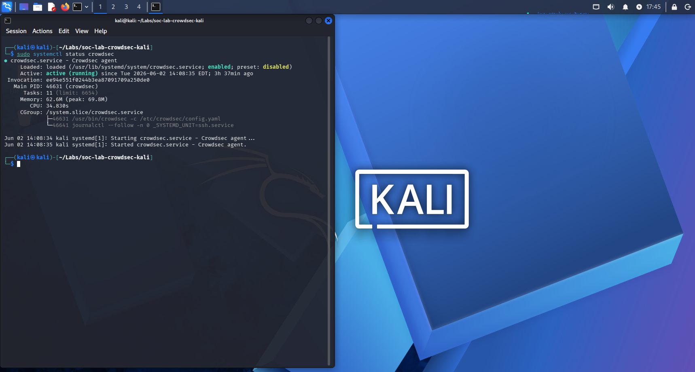
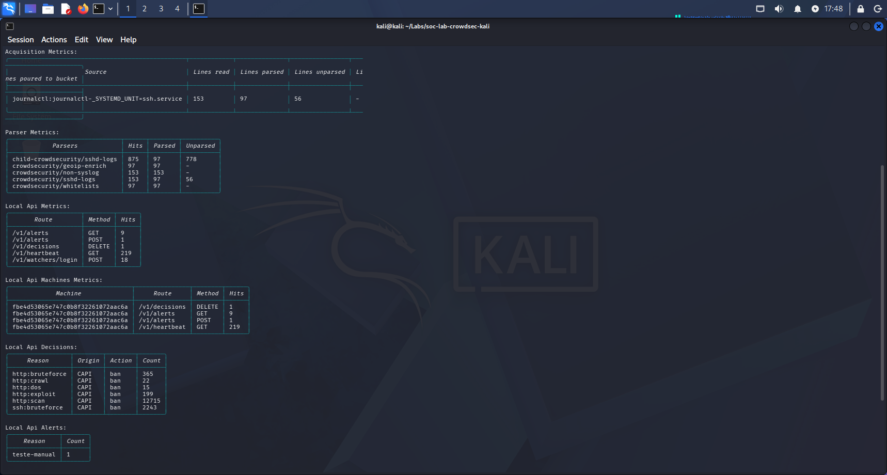
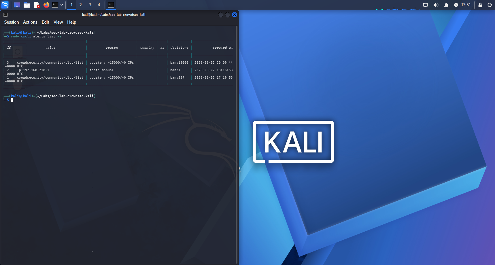
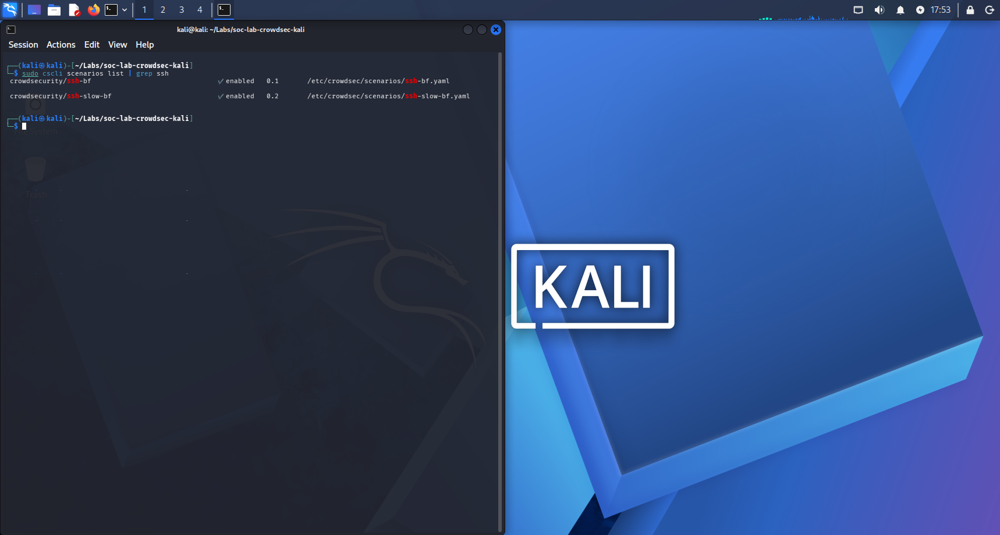

# CrowdSec Lab - Monitoramento e Detecção de Ameaças SSH

## Objetivo

Implementar e configurar o CrowdSec para monitoramento de logs, detecção de tentativas de brute force SSH e geração de alertas em ambiente Linux.

---

## Ambiente Utilizado

### Hardware

* Intel Core i7-10700T
* 16 GB RAM
* VMware Workstation

### Sistema Operacional

* Kali Linux

### Ferramentas

* CrowdSec
* OpenSSH
* VMware

---

## Objetivos do Laboratório

* Instalar e configurar o CrowdSec
* Monitorar eventos SSH
* Detectar tentativas de brute force
* Analisar métricas e alertas
* Entender o funcionamento de collections, parsers e scenarios

---

## Configuração

Arquivo de aquisição configurado:

```yaml
source: journalctl
journalctl_filter:
  - "_SYSTEMD_UNIT=ssh.service"
labels:
  type: sshd
```

---

## Evidências

### Status do Serviço



### Métricas do CrowdSec



### Alertas Gerados



### Cenários SSH



---

## Aprendizados

Durante este laboratório foi possível compreender:

* Monitoramento de logs SSH
* Configuração de acquisition files
* Collections e Scenarios
* Parsers do CrowdSec
* Métricas e Alertas
* Conceitos de brute force detection
* Troubleshooting em Linux
* Conceitos básicos de SOC e Blue Team

---

## Próximos Passos

* Integração com Suricata
* Integração com Wazuh
* Correlação de eventos
* Construção de um mini SOC em laboratório

```
```
